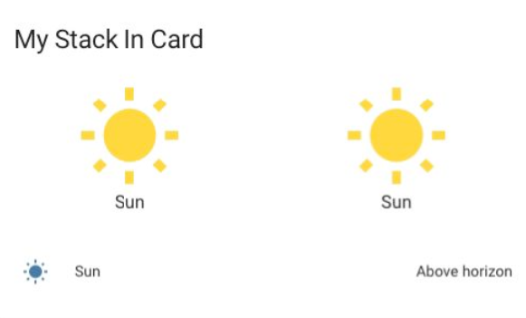

# Stack In Card by [@RomRider](https://www.github.com/RomRider)

A replacement for [vertical-stack-in-card](https://github.com/ofekashery/vertical-stack-in-card) and `horizontal-stack-in-card`

It allows to group multiple cards into one card without the borders. By default, it will stack everything vertically.

[![GitHub Release][releases-shield]][releases]
[![License][license-shield]](LICENSE.md)
[](https://github.com/custom-components/hacs)

![Project Maintenance][maintenance-shield]
[![GitHub Activity][commits-shield]][commits]

[![Discord][discord-shield]][discord]
[![Community Forum][forum-shield]][forum]

## Options

If a card inside the stack has the `--keep-background` CSS style defined, it will not replace the background. This is usefull for [button-card](https://github.com/custom-cards/button-card) for example. You can also define this CSS variable by using [card-mod](https://github.com/thomasloven/lovelace-card-mod).

| Name | Type | Requirement | Description | Default |
| ---- | ---- | ----------- | ----------- | ------- |
| `type` | string  | **Required** | `custom:stack-in-card` | |
| `title` | string  | **Optional** | Header of the card | |
| `mode` | string  | **Optional** | `vertical` or `horizontal` stack | `vertical` |
| `cards` | object  | **Required** | The cards you want to embed | `none` |
| `keep` | object | **Optional** | See [keep object](#keep-object) | |

### `keep` object

| Name | Type | Requirement | Description | Default |
| ---- | ---- | ----------- | ----------- | ------- |
| `background` | boolean | **Optional** | Will keep the background on **all** the child cards. To keep the background on specific cards only, assign the CSS variable `--keep-background: 'true'` on the card where you want to keep the background.  | `false` |
| `box_shadow` | boolean | **Optional** | Will keep the `box-shadow` on **all** the child cards | `false` |
| `margin` | boolean | **Optional** | Will keep the `margin` between **all** the child cards | `false` |
| `outer_padding` | boolean | **Optional** | Will add a `padding` of `8px` to the card if `margin` is `true` | `true` if `margin` is `true`, else false |
| `border` | boolean | **Optional** | Will keep the `border` on **all** the child cards | `false` |
| `border_radius` | boolean | **Optional** | Will keep the `border-radius` on **all** the child cards | `false` |

## Example

### Simple Example



```yaml
- type: custom:stack-in-card
  title: My Stack In Card
  mode: vertical
  cards:
    - type: horizontal-stack
      cards:
        - type: button
          entity: sun.sun
        - type: button
          entity: sun.sun
    - type: vertical-stack
      cards:
        - type: entities
          entities:
            - sun.sun
```

### Example with button-card to keep the background

This will keep the background of the button even if stacked:

```yaml
- type: custom:stack-in-card
  title: My Stack In Card
  mode: vertical
  cards:
    - type: custom:button-card
      entity: sun.sun
      color_type: card
      styles:
        card:
          - --keep-background: 'true'
```

## Installation

Use [HACS](https://hacs.xyz) or follow this [guide](https://github.com/thomasloven/hass-config/wiki/Lovelace-Plugins)

```yaml
resources:
  url: /local/stack-in-card.js
  type: module
```

[commits-shield]: https://img.shields.io/github/commit-activity/y/custom-cards/stack-in-card.svg?style=for-the-badge
[commits]: https://github.com/custom-cards/stack-in-card/commits/master
[devcontainer]: https://code.visualstudio.com/docs/remote/containers
[discord]: https://discord.gg/5e9yvq
[discord-shield]: https://img.shields.io/discord/330944238910963714.svg?style=for-the-badge
[forum-shield]: https://img.shields.io/badge/community-forum-brightgreen.svg?style=for-the-badge
[forum]: https://community.home-assistant.io/t/stack-in-card-drop-in-replacement-for-vertical-stack-in-card/180072
[license-shield]: https://img.shields.io/github/license/custom-cards/stack-in-card.svg?style=for-the-badge
[maintenance-shield]: https://img.shields.io/maintenance/yes/2020.svg?style=for-the-badge
[releases-shield]: https://img.shields.io/github/release/custom-cards/stack-in-card.svg?style=for-the-badge
[releases]: https://github.com/custom-cards/stack-in-card/releases
